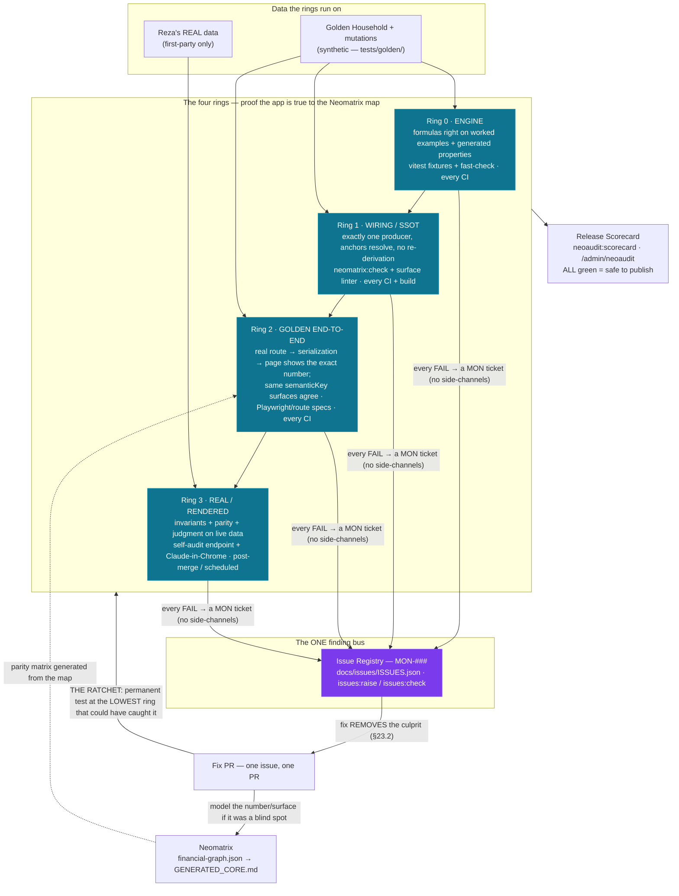

# NEOAUDIT — the Monitrax verification platform

> **NeoAudit is the audit arm of the Neo family: the Neomatrix is the MAP (what every number is, how it's produced, where it renders); NeoAudit is the PROOF (is the app true to the map — everywhere, always, on any data).** It is NOT a new platform in the Part 22 sense: it consumes the ONE inventory (`calcEngineRegistry`), the ONE map (Neomatrix), and the ONE proof spine (calc-audit fixtures), and adds rings, scenarios, briefs and a scorecard on top.
>
> Law: `CLAUDE.md` Part 23 (four rings, REMOVE-THE-CULPRIT, the Ratchet, VERIFIED-requires-Ring-3). Ring-3 operating manual: `docs/verification/VERIFICATION_PLAYBOOK.md`. Tickets: `docs/issues/ISSUES.json` (MON-###). This doc is the platform blueprint.
>
> Reza directives (2026-07-11/12): *"zero fail … 100% correctness"* · *"remove the culprit — do not add more code on top of the broken one"* · *"check the numbers and everything on Monitrax … tiles, dashboards, secondary calculations"* · *"Claude Chrome to be my eyes and ears"* · *"push buttons, check results (not changing any numbers)"* · *"I don't want to duplicate tools on same functions or overstep each other — clear roles and responsibilities with well defined handshake procedure."*

---

## At a glance — the reference layer (added 2026-07-14)

> Orientation for a new reader (or a future session) before the dense spec below. **The one-line model:** the **Neomatrix** is the MAP of every money number; **NeoAudit** proves the app is true to that map on four rings; every failure flows to the **ONE registry**; every fix ratchets **down** into a permanent lower-ring test — so coverage only grows and the human Chrome brief only shrinks.

### The system in one picture

**The growth loop (why it's a LIVE system, §10):** a Ring-3 finding → registry → root-caused fix → a permanent lower-ring test (the Ratchet) → the Chrome brief stops re-checking that class. Every run leaves NeoAudit stronger; the automated rings grow, the human eyeball shrinks. The workstream is **standing, never closed.**

### Component / file index — where every piece lives (as-built, verified 2026-07-14)

| Ring / role | Component | Path | Runs / command |
|---|---|---|---|
| **The map** | Neomatrix graph (SSOT) + human view | `docs/financial-logic/graph/financial-graph.json` → `GENERATED_CORE.md` | `npm run neomatrix:generate` |
| R0 · engine | calc-audit fixtures + fast-check properties | `tests/golden/*.test.ts`, `tests/calculations/`, `tests/tax/` | every CI (`npm test`) |
| R1 · wiring/SSOT | graph gate + surface linter | `scripts/neomatrix/` — `npm run neomatrix:check`, `lint:financial-surfaces` | every CI + `vercel-build` |
| R2 · golden data | the Golden Household "Avalon" | `tests/golden/goldenHousehold.ts` | every CI |
| R2 · route/service tier | end-to-end specs (real handler → JSON → parity) | `tests/golden/ring2.{masterSnapshot,propertyRoute,portfolioSnapshotRoute,safetyNetRoute,cashflowRoute,reportReconciliation,healthInput,cfoScoreDedup}.test.ts` | every CI |
| R2 · parity matrix | map-driven cross-surface value parity + coverage ratchet | `tests/golden/parityMatrix.ts` (+ `.test.ts`) | every CI |
| R2 · Tier-2 oracle | independent Decimal re-derivation over ~30 mutations | `tests/golden/tier2/` | every CI |
| R2 · Tier-3 metamorphic | snapshot-level invariant laws (fast-check) | `tests/golden/ring3.metamorphic.test.ts` | every CI |
| R3 · self-audit | invariants on real data (first-party) | `lib/verification/selfAuditInvariants.ts` → `app/api/verify/invariants/`, `app/api/admin/neoaudit/` | on demand (panel/endpoint) |
| R3 · admin panel | one-click scorecard on real data | `app/admin/neoaudit/` | Reza, per release |
| R3 · eyes & ears | Claude-in-Chrome brief library | `docs/verification/VERIFICATION_PLAYBOOK.md` | relay, scheduled |
| R3 · agent (synthetic) | Playwright-MCP exploratory runbook | `docs/verification/PLAYWRIGHT_MCP_RUNBOOK.md` | on demand |
| Finding bus | issue registry + gate + raiser | `docs/issues/ISSUES.json`, `scripts/issues/{check,raise}-issue.mjs`, `tests/issues/registry.test.ts` | `issues:check` (CI) · `issues:raise` |
| Guard-tests | Stryker weekly mutation | `stryker.conf.json`, `.github/workflows/stryker-weekly.yml` | weekly cron |
| Publish gate | Release Scorecard | `lib/verification/scorecard.ts` → `scripts/neoaudit/scorecard.ts` | `npm run neoaudit:scorecard` |

### The doc map — which document answers which question

| Question | Document |
|---|---|
| **What is the law?** (rings, remove-the-culprit, Ratchet, VERIFIED-requires-Ring-3) | `CLAUDE.md` Part 23 |
| **What is the platform?** (this doc — architecture, nodes, scenarios, tooling, build log, growth loop) | `docs/blueprint/NEOAUDIT.md` |
| **How do I run a Ring-3 real-data check?** (briefs, baselines, procedure) | `docs/verification/VERIFICATION_PLAYBOOK.md` |
| **How does Claude Chat AUTOMATE the relay?** (conductor between Code + Chrome — no manual copy-paste) | `docs/verification/NEOAUDIT_ORCHESTRATION.md` |
| **How is ANY issue fixed, start to finish?** (the six-stage pipeline + per-fix Chrome verify) | `docs/issues/FIX_PROTOCOL.md` (law: `CLAUDE.md` Part 24) |
| **What's found / fixed / pending?** (the plain-English ledger) | `docs/issues/ISSUES.md` (generated from `ISSUES.json`) |
| **How is every number produced?** (the map) | `docs/financial-logic/graph/GENERATED_CORE.md` |

---

## 0. What NeoAudit is — and how Reza uses it (operator guide)

**It is three things in layers; your personal surface is deliberately tiny.**

| Layer | What it is | Who operates it | What you do |
|---|---|---|---|
| **System** (most of it) | rules + gates baked into CI, the Vercel build and CLAUDE.md — rings 0–2, parity matrix, scenario lab, Stryker, linters | itself, on every PR | nothing — green/red on the PR. Red blocks merge; Claude fixes it |
| **Platform** | the in-app NeoAudit admin panel: one button → invariants + Release Scorecard computed on YOUR real data | you, one click | open it after money merges / before a release. **Green scorecard = safe to publish** — that IS the publish decision |
| **Tool** | the Chrome brief library (Eyes & Ears) | **Claude Chat as conductor** (`docs/verification/NEOAUDIT_ORCHESTRATION.md`) — or you, by manual relay | give Claude Chat the orchestration doc once; it ferries briefs/reports between Claude Code and Chrome verbatim and drives per-fix re-checks. Your role shrinks to approving forks + reviewing outcomes (manual paste relay remains the fallback) |

**Your complete usage manual — four interactions:**
1. **Merge PRs when green.** Nothing else at the system layer needs you.
2. **Open the NeoAudit panel** after money-touching merges and before any release → read PASS/FAIL + the scorecard.
3. **Run a Chrome brief when handed one**; paste the output back. Claude compares, raises MON tickets, ratchets tests.
4. **Confirm fixes on your numbers** when asked — your "yes" moves an issue to VERIFIED. Browse `docs/issues/ISSUES.md` anytime as the plain-English ledger of everything found / fixed / pending.

You never memorise rules: CLAUDE.md Part 23 binds every Claude session to this machine automatically, and the playbook lets any future session run it cold.

**NeoAudit is LIVE — it never stops getting better (§10).** Every issue a Chrome brief finds is fed back into the structure as a permanent lower-ring test (the Ratchet), so the same class can never escape again and coverage grows toward 100% of Monitrax. The §8 build is complete; the **growth loop runs for the life of the product** — the workstream is standing, never closed.

## 1. Architecture — rings, nodes, and the ONE handshake

### 1.1 The rings (from CLAUDE.md Part 23, unchanged)

| Ring | Proves | Runs |
|---|---|---|
| **0 — Engine** | each formula right on worked examples + generated properties | every CI |
| **1 — Wiring/SSOT** | one producer per number; graph anchors resolve; no re-derivation | every CI + build |
| **2 — Golden end-to-end** | known synthetic data → the real route/serialization/page path → the exact hand-computed number + pixels; same-`semanticKey` surfaces agree | every CI |
| **3 — Real/rendered** | invariants + parity + judgment on live data and rendered UI | post-merge / scheduled |

### 1.2 Roles & responsibilities — ONE QUESTION, ONE TOOL (non-overlap contract)

Every check lives at **exactly one node**. A node answers its question and nothing else. No tool asserts what a lower ring already asserts.

| Node | Tool (owner) | Sole responsibility — the ONLY question it answers | Hands off to |
|---|---|---|---|
| **R0-fix** | vitest + calc-audit fixtures | "Is this formula right on these worked examples?" | registry on FAIL |
| **R0-gen** | **fast-check** (`@fast-check/vitest`) | "Does this engine hold its mathematical properties on thousands of generated inputs?" (monotonicity, round-trips, additivity, bounds) | shrunk counter-example → a new R0-fix fixture + MON ticket |
| **R1** | `neomatrix:check` + surface linter + source-lock tests | "Is there exactly one producer, correctly wired, at a resolvable anchor?" | registry on FAIL |
| **R2-num** | Playwright checked-in specs + golden seeds | "Does the rendered page show the manifest's exact number on golden data?" (text assertions ONLY) | registry on FAIL |
| **R2-vis** | Playwright `toHaveScreenshot()` (→ Argos later) | "Do the pixels match the approved baseline?" (NEVER asserts numbers) | registry on FAIL |
| **R3-agent** | **Playwright MCP** (Claude session, headless) | "Exploratory: does anything look wrong on a golden-seeded preview?" — agent-driven, synthetic data ONLY, no permanent assertions live here | every repeatable discovery is **promoted** to an R2 spec (and stops being an R3 check); finding → MON |
| **R3-self** | self-audit endpoint `/api/verify/invariants` (own data) + admin-targeted `/api/admin/neoaudit?userId=…` (selected user) + admin panel picker | "Do the invariants hold on the user's REAL data right now?" (server-side, first-party only) | FAIL → MON with lhs/rhs/delta |
| **R3-eyes** | **Claude-in-Chrome** (Reza relay, brief library §4) | "On real data, rendered: judgment — numbers cross-checked, copy, forms, visuals, functionality, journeys" — ONLY what no automated ring can judge | findings → MON; anything mechanical → Ratchet to R2/R0 |
| **Guard-tests** | **StrykerJS** (weekly, scoped to `lib/calculations` + `lib/tax-engine` + `lib/health`) | "Would the test suite actually catch a broken formula?" | surviving mutant → MON (test-gap class) |
| **Guard-crash** | **GCP Error Reporting** (§13.9) | "Did production throw?" (crashes/NaN renders ONLY — never numeric correctness) | alert → MON |

### 1.3 The handshake procedure (how nodes interoperate without mixing)

1. **All findings flow through ONE node: the issue registry** (`docs/issues/ISSUES.json`). No side-channels — not chat memory, not PR comments, not tool dashboards. Every node's FAIL becomes a MON-### with evidence (surface, expected, actual, run/job ID); `npm run issues:raise` pre-fills it (de-dup by semanticKey+surface).
2. **Fixes travel DOWN (the Ratchet):** a bug found at ring N gets its permanent test at the LOWEST ring that could have caught it. The higher ring then never re-checks it — promotion, not duplication.
3. **Discoveries travel UP only as tickets:** R3 nodes never grow permanent assertion suites; the moment a check is repeatable it moves into R2/R0 and is DELETED from the R3 scope.
4. **Data boundaries are absolute:** third-party/agentic tools (fast-check, Playwright MCP, Stryker, visual diff) operate on synthetic/golden data only. Real data is touched by exactly two nodes — R3-self (first-party code) and R3-eyes (Reza's own browser). CDR: nothing real ever leaves first-party (§13).
5. **The scorecard is the ONE aggregation point** (§6): each node reports green/red into it; no node interprets another node's results.

**Anti-overlap acceptance rule (reviewer-enforced):** a PR adding a check must state which node owns it and why no lower node can. A check added at two nodes, or a tool asserting outside its "sole responsibility" column, is rejected — that's the §12.2.1 duplicate-source rule applied to tests.

---

## 2. Scenario Lab (the data NeoAudit runs on)

**Tier 1 — authored scenarios** (`tests/golden/scenarios/`): named households, each with a manifest of hand-computed expected values (§19.2) for every headline number, tile, report line, and CFO flag. Starting six: `base` (mirrors Reza's real shapes — fortnightly rent, geared + owner-occupied + $0-purchase, one-offs, partial reconciliation) · `high-gear` (104% LVR, IO loan, negative cashflow) · `renter` · `retiree` · `edge` ($0-income month, uncategorised, transfers, negative equity) · `reform-straddle` (assets either side of 2026-05-12; Phase 41E regimes).

**Tier 2 — combinatorial mutation with an independent oracle:** a generator mutates scenarios along axes (frequency × ownership × loan type × reconciliation depth × one-offs × negative equity); expected values come from the **calc-audit Decimal shadow engines extended to snapshot level** — a second derivation, so the engine is never checked against itself. (Part 22: new properties = new fixtures on the same spine, never a parallel silo.)

**Tier 3 — metamorphic invariants** (fast-check-driven): laws that hold under ANY input — add $100/mo expense ⇒ cashflow −$100/mo on every surface, net worth unchanged; add a transfer ⇒ nothing changes; double all amounts ⇒ ratios unchanged, totals double; sell property ⇒ net worth continuous. These catch combination bugs no enumerated scenario can.

Historical seed: every finding in `docs/audits/*` and every closed MON becomes a scenario row or decision-table row — past bugs are permanent scenarios.

## 3. Judgment layers — CFO, budgeting, reports

- **Numeric inputs:** every figure a CFO card/report cites is a graph node → covered by the parity matrix (§5).
- **Decision tables:** each recommendation rule gets explicit given→then fixture rows (LVR>100% ⇒ NO refinance rec; negative cashflow ⇒ no positive-cashflow credit; monthsCovered<1 ⇒ EF rec present and first). VR-001's refinance-at-104% is row one. Wrong advice = build failure.
- **Report reconciliation locks:** Σ report lines === canonical total (same pattern as `expenseLines`/`loanLines`); reports render under R2 golden.
- **AI advisor:** `lint:ai-grounding` + scenario tests assert the advisor's tool layer can only surface canonical figures.

## 4. Eyes & Ears — the Claude-in-Chrome brief library (R3-eyes)

Versioned briefs (paste-and-run, machine-comparable output); canonical texts live in `docs/verification/VERIFICATION_PLAYBOOK.md`:

| # | Brief | Scope | Cadence |
|---|---|---|---|
| 1 | **VR — Numbers** | cross-surface parity, invariants, regression snapshot vs baseline | after every money-touching merge |
| 2 | **UX & Copy** | warm-words rule (§14), no jargon/shaming/emojis/"!", AFSL GAW present, AU formats | weekly rotation |
| 3 | **Forms** | labels, defaults, validation messages, error states — fill + validate + **Cancel** (no saves) | per release |
| 4 | **Visual QA** | §18.7.2 conformance on real data: dark mode, truncation, alignment, pills, empty/loading states | per release |
| 5 | **Journeys** | TRAIL flows end-to-end; CFO advice read against visible data — does it make sense | per release |
| 6 | **Reports** | report totals tie to on-screen totals; formatting, completeness | per release |
| 7 | **Functional** | every control does something sane (§6.7 no-dead-ends); navigation truth; what-if levers move outputs in the RIGHT DIRECTION (UI metamorphic checks); states appear | per release |

**Safety contract (verbatim in every brief):** (1) NEVER Save/Submit/Delete/Confirm on a real record — Cancel out of every form; (2) ephemeral surfaces (what-if sliders, previews, filters) are unrestricted; (3) anything behind a confirmation dialog = hard stop, report instead; (4) writes only in an explicitly-labelled `[ACTION]` step approved per run — labelled test records, verified, then deleted.

## 5. Parity matrix (Neomatrix-driven test generation)

A generator reads `financial-graph.json` and emits one R2 check per (semanticKey × surface-pair): the same number, on every surface that renders it, must be equal on golden data. Coverage is therefore **generated from the map, never hand-listed** — and the existing census/binding gates already fail the build if a money surface isn't modelled. New tile ⇒ must be in the graph ⇒ automatically in the matrix.

## 6. Release Scorecard (the publish gate)

One generated readout — publish when ALL green: Rings 0–2 green on CI · R3-self invariants ALL PASS on live data · latest VR run clean vs `docs/verification/baselines/BASELINE.md` · zero OPEN number-issues in the registry · Stryker weekly: no unreviewed surviving mutants in scoped engines. Rendered in the NeoAudit admin panel; stated only as gate output, never as a claim (§22.2.4).

## 7. Tooling register (researched 2026-07-11; full evaluation with sources in the changelog)

| Tool | Node | Verdict | Reason (one line) |
|---|---|---|---|
| fast-check | R0-gen | **ADOPT NOW** | zero-infra property/metamorphic engine on the existing vitest spine; targets our exact bug classes |
| Playwright MCP (Microsoft) | R3-agent | **ADOPT NOW** | agent-driven headless verification of golden previews; retires most of the manual Chrome relay; synthetic-only |
| GCP Error Reporting | Guard-crash | **ADOPT NOW** | already required by §13.9 (P1); GCP-first; crashes only |
| StrykerJS | Guard-tests | **ADOPT (scoped)** | weekly, incremental, `lib/calculations` + `lib/tax-engine` + `lib/health` only; never per-PR |
| Argos CI / Lost Pixel | R2-vis | later | only when `toHaveScreenshot` baseline churn hurts; Argos preferred (plain-Playwright, OSS) |
| axe-core (@axe-core/playwright) | R2 add-on | later | one-day add to the UAT job; quality, not numeric correctness |
| Chrome DevTools MCP | R3-agent debug | later | agentic console/network/perf reads when diagnosing R3 failures |
| Checkly | prod monitoring | at first paying user | GH-Actions cron + Vercel alerts cover today for $0 |
| Meticulous.ai | — | **SKIP — CDR-disqualified** | captures cookies/storage/network payloads to their cloud (verified from their docs) |
| Percy / Chromatic | — | skip | cost / Storybook-shaped for no marginal value |
| Hosted agent browsers (Browserbase etc.) | — | skip | needless third-party data path; local headless Playwright MCP suffices |
| AI "QA platform" vendors | — | skip | duplicate Claude Code + the checked-in suite |
| MON-109 threshold-trace detector | R1-lint | **LANDED 2026-07-28** | tax-threshold numerals (percentage comparisons, currency magnitudes ≥ $1k) in `components/tax/**` fail CI unless annotated `@tax-threshold-allowed`; the engine constants are the ONE source (`tests/tax/mon109ThresholdTrace.test.ts`) |
| MON-110 no-surface-arithmetic audit | R1-lint | **LANDED 2026-07-28** | VR-037 Part D's hand-run "cards do no tax arithmetic" guard promoted to CI — any `+ − * /` on an engine result field in `components/tax/**` fails (`tests/tax/mon110GainBeforeConcessions.test.ts`) |

**Boundary restated:** third-party tools operate on synthetic/golden data only; real data is first-party only (R3-self, R3-eyes).

## 8. Build plan (each its own PR, §20.4 scores recorded)

1. ✅ Foundations — Part 23 law, playbook, VR-001, baseline, ratchet tests (PRs #1358/#1359, merged)
2. ✅ Self-audit endpoint (`/api/verify/invariants`, PR #1361, merged) + NeoAudit admin panel (`/admin/neoaudit`, PR #1364, merged) — R3-self + scorecard v1 (invariant half; CI/registry half = step 6). **Audit-any-user picker (2026-07-12):** the invariant computation is now one shared `lib/verification/selfAuditInvariants.ts` called by both the self endpoint AND a new admin-gated `GET /api/admin/neoaudit?userId=…` (same posture as `/api/admin/users` — `verifyAdminGCPAuth` + `users:read` + audit-logged, aggregates+identities only per §13); the panel gains an "Audit account" picker so Ring-3 runs on real user data, not just the empty admin account.
3. ✅ Scenario Lab: **fast-check Ring-0-gen properties landed** (`tests/golden/*.test.ts`, PR #1365 merged — frequency laws, engine decomposition/additivity, net-worth/savings/aggregator identities, authored high-gear scenario). **Ring 2 service-tier landed (2026-07-12):** the Golden Household "Avalon" (`tests/golden/goldenHousehold.ts` — every number hand-computed, fixture rows mirror `fetchAllUserData`'s exact selects) runs through the REAL `getMasterFinancialSnapshot` via a mocked `@/lib/db` that THROWS on any un-served model (`ring2.masterSnapshot.test.ts`, 16 assertions: net-worth assembly incl. SMSF/SOLD exclusions, declared cashflow + savings rate, rental dedup, emergency fund, per-property metrics, quickMetrics mirrors, the MON-028-class input-parity check engine-vs-snapshot, the Ring-3 report ALL-PASS tie, and two NEGATIVE CONTROLS proving the harness can fail — dropped-loan parity break + zeroed-liabilities report FAIL). **Route-tier Ring 2 landed (same day):** `ring2.propertyRoute.test.ts` invokes the ACTUAL `GET /api/properties/[id]` handler (the MON-028 type specimen) in-process on the golden household — real handler body + `verifyOwnership` + `enrichPropertiesWithActuals` + NextResponse serialization; mocked: `withPermission` (injects the golden user — token verification is Ring-1/unit territory) and `@/lib/db` (`findUnique` honours `where.id` so the 404/ownership path stays live). Asserts: `linkedTransactions` present in the JSON (THE dropped-field regression), relations survive serialization, page-level parity (serialized payload → `computePropertyCashflow` reproduces the manifest), unknown id → 404. **Safety-net route landed (same day):** `ring2.safetyNetRoute.test.ts` — the MON-017 surface end-to-end (real master snapshot → canonical cashflow → computeSafetyScore → serialized JSON), asserting exactly 70/BUILDING on the golden household; golden-DB mock unified into one exported `createGoldenDb()` helper. **Portfolio-snapshot route landed (2026-07-12):** `ring2.portfolioSnapshotRoute.test.ts` — the ACTUAL `GET /api/portfolio/snapshot` (the Home net-worth source; MON-013/014 type specimen) invoked in-process on the golden household, LOCKING that its net worth / total assets / liabilities equal the master manifest (472,000 / 992,000 / 520,000) — the cross-surface convergence that MON-013/014 unified onto the ONE `calculateNetWorth`. Required a harness capability: `createGoldenDb` now resolves Prisma `include` queries (this route uses deep nested includes, unlike the master's flat select) via an explicit `INCLUDE_KINDS` map that serves each relation EMPTY (`[]`/`null`) and THROWS on any unmapped relation (fail-loud, no FK-resolver magic that could produce a false green). **Honest boundary:** because nested includes are empty, a Ring-2 test on this harness verifies the HEADLINE canonical figures (computed from top-level arrays), NOT the SnapshotV2 GRDCS `_links`/`_meta` relational layer — that needs FK-resolved fixtures, a later harness capability. **Cashflow route landed (2026-07-12):** `ring2.cashflowRoute.test.ts` — the ACTUAL `GET /api/cashflow` (the MON-020/021/027/029 surface) at two rigor levels, honestly: LITE mode (`?type=lite`) summary asserted EXACTLY (income 10,400 / expenses 1,700 / net 8,700 / burn 1,700 / withdrawable 44,900 / breakEvenDay 5, all hand-computed §19.2); FULL mode runs the real `buildCFEInput → generateForecast → buildCOEInput → generateOptimisations` pipeline end-to-end and asserts it EXECUTES on golden data (catches the crash/plumbing class) + the accounting identity (net = income − expenses) + all-finite (no NaN projection leak) — but does NOT assert exact day-by-day projection values (not hand-computable; Ring-0 fixture territory). Golden book gained `spendingProfile: []` (full-mode COE reads it via findUnique → null → declared branch). Remaining Ring-2 backlog: Playwright rendered-page tier (needs `@playwright/test` installed — a bigger infra add, deferred per §7 triggers). **Route-tier Ring 2 now covers: properties detail, safety-net, portfolio-snapshot, cashflow.**
4. ✅ Parity-matrix generator (§5) — **landed 2026-07-12.** `tests/golden/parityMatrix.ts` (generator + resolver registry) + `parityMatrix.test.ts` (the R2 value-parity check) read `financial-graph.json`'s `rendered-at` edges and, for every semanticKey rendered at ≥2 surfaces, assert the SAME number resolves to the SAME VALUE on the Golden Household via each surface's OWN path — STRICTLY distinct from `neomatrix:check` A3b (R1 *structural* convergence "same-key → same engine"); the matrix proves the wiring produces one VALUE end-to-end (the MON-028 class: same engine, different inputs). **THE COVERAGE RATCHET (Reza directive 2026-07-12 "keep NeoAudit getting more complete toward 100%"):** every `rendered-at` surface MUST be in `SURFACE_RESOLVERS` (faithful golden extractor) OR `KNOWN_UNRESOLVED` (stated reason + a growth item) — a surface in neither FAILS the coverage test, so a new tile can't enter the graph without being covered or visibly tracked. Includes negative controls (orphan surface caught; a value drift detected). **Honest coverage readout (printed, a build output not a claim — §22.2.4): 8/18 surfaces resolved · 10 tracked-pending · 1 multi-surface parity group asserted (`propertyCashflow`: the /properties/[id] ROUTE path and the master-service path independently land on −$400).** Resolved: home.netWorthTile (portfolio route), dashboard cashflow/savingsRate/income tiles (master), properties detail (route) + list + dashboard tiles (master), safetyNet.safetyScore (route). Faithful-path resolvers only — where a value can't be produced without guessing a field/concept, the surface is DEFERRED, never resolved with a lookalike (a guessed field is the false green this matrix prevents). CI: `npm test` runs `tests/golden`, so the matrix gates every PR.

   **Parity-matrix coverage-growth queue (the tracked path to 100% — each is a `KNOWN_UNRESOLVED` entry today; pick off as fixtures/resolvers land):**
   - `ui.cashflow.hero` — canonical-cashflow resolver (monthlyCashflow + page-derived savingsRate); the route exposes a 30-day forecast, not clean scalars.
   - `ui.activity.cashflowTiles` — /activity route resolver (monthlyCashflow tiles).
   - `ui.dashboard.outgoingsTile` — monthlyOutflow resolver (expenses vs expenses+repayments concept, explicit).
   - `ui.dashboard.tax` — taxPayable via the tax engine on golden data (**step-5**).
   - `ui.home.healthTile` — healthScore resolver (**MON-030 / step-5**).
   - `ui.cfo.scoreTile` — cfoScore resolver (**MON-030 / step-5**).
   - `ui.dashboard.netWorthTrendTile` + `ui.cfo.monthlyProgress` — need **historical-snapshot golden fixtures** (golden book is single-point-in-time; netWorthTrend has no trend to compute). *(New coverage-growth gap discovered this PR.)*
   - `ui.dashboard.moneyStoryHero` — financialIndependence resolver (moneyStoryMargin).
   - `ui.balances.hiddenWealth` — **model accessibilityBuckets number nodes with semanticKeys** first (its ui-surface carries no key today, so it has no parity partner) + per-bucket resolver. *(New Neomatrix-modelling gap discovered this PR — §21.2 backfill.)*
   - **Neomatrix gap (discovered this PR):** `ui.safetyNet.safetyScore` and `ui.balances.hiddenWealth` are fed directly by ENGINE nodes and carry no `semanticKey`, so they can't join key-based parity groups. Model number nodes (with semanticKeys) for `safetyScore` and the `accessibilityBuckets` outputs so these surfaces enter the matrix properly (safetyScore is resolved for coverage/manifest-tie today, but has no parity partner until keyed).
5. ✅ CFO decision tables + report reconciliation locks (§3) — **COMPLETE 2026-07-13** (EF decision table · refinance reused · negative-cashflow verified · report reconciliation → caught+fixed MON-034 · MON-030 stages 1 + 2a + 2b; MON-030 stays FIXING for Reza's live verify).
   - ✅ **EF recommendation decision table landed 2026-07-12** — `tests/cfo/actionEngineDecisionTable.test.ts` locks the emergency-fund rule of `generateActions` as explicit given→then rows (verified in source §19.2): buffer <30 → EF rec present, severity high, priority do_now, and FIRST; 30–49 → present, medium, upcoming; 50–59 → NO rec (the rule gates at <50 even though findWeakAreas flags <60 — the honest edge); ≥60 → no rec; + a monotonic-urgency guard. Driven through the real engine with an EMPTY db (isolates the score-driven rule from optimisation/risk actions). **Honest boundary:** verifies the rule's presence/severity/priority/first-ness as the engine computes them on controlled score inputs; does NOT verify the score components themselves (MON-030) or the rendered page (R2-vis).
   - **§12.2.1 discovery (this PR):** the REFINANCE decision rule (LVR ceiling) is ALREADY fixtured as given→then rows in `tests/cfo/loanDecisionSupportGuards.test.ts` (MON-019: 104% LVR → worthRefinancing false; 50% → true; non-property → not gated). It is NOT re-tested — re-fixturing an existing rule's table would be the duplication §1.2 forbids. Refinance = **done**, reused as-is.
   - **Decision-table queue (the tracked path to full §3 coverage):**
     - ✅ "negative cashflow ⇒ no positive-cashflow credit" (§3 example) — **VERIFIED & resolved 2026-07-12.** The rule EXISTS in `lib/calculations/safetyScore.ts:75` (MON-017): `cf > 0 ? 15 : cf > -200 ? 8 : 0` — a real deficit (≤ −$200) scores 0 on the positive-cashflow dimension (no credit), a marginal deficit (−200 < cf ≤ 0) scores 8, positive scores 15. It is NOT a recommendation guard but a SCORING sanity ("no full marks", per VR-001). **Already fully fixtured** — all three tiers in `tests/calculations/safetyScore.test.ts` + the VR-001 extremes in `tests/verification/vr001Ratchet.test.ts` (§12.2.1: NOT re-tested — the refinance-pattern, an existing rule's table isn't duplicated). The only micro-gap (exact tier boundaries cf=0→8, cf=−200→0) was closed with a 4-assertion completion in the existing test. No new engine, no MON — the rule was correct + covered.
     - `monthsCovered<1 ⇒ EF rec FIRST` as a HARD universal guarantee — the engine currently makes EF do_now/high only when the buffer is the pressing weakness; "always literally first" isn't guaranteed if a critical risk action co-exists. If §3 wants it as a hard rule, that's a prioritisation change + a MON, not an assertion.
     - ✅ **Report reconciliation locks landed 2026-07-12 — AND caught MON-034 on the first run.** `tests/golden/ring2.reportReconciliation.test.ts` locks the income/expense report on the Golden Household through the REAL `buildReportContext → generateIncomeExpenseReport` path: INTERNAL (Σ line rows === section total) + CROSS-SOURCE (report annual income/expenses === canonical master monthly × 12 = 124,800 / 20,400). **On its first run the cross-source lock FAILED (report expenses 46,800 ≠ master 20,400) — a real bug (MON-034):** a duplicate frequency converter (`calculateAnnualAmount` in `contextBuilder.ts`) had cases for `ANNUALLY`/`YEARLY` but NOT the real Prisma enum value `ANNUAL`, so ANNUAL entries fell to `default: ×12` — over-stating any yearly income/expense 12× in BOTH the income-expense AND tax-time reports (the tax one inflates deductions → understates taxable income). **Fixed at source (§12.2.1 + Part 23 remove-the-culprit):** deleted the duplicate, use canonical `toAnnual`. Downstream (§19.4): the tax-time report inherits the fix (a focused deduction lock + negative control). Harness grew: `createGoldenDb` now supports `.count()` + a `depreciationSchedule` model. This is the NeoAudit reconciliation layer doing exactly its job — a cross-source lock finding a real drift on day one.
     - 🟡 MON-030 (health/CFO/Safety score divergence, `changesNumbers:true`) — Reza's option B: keep the familiar 6 CFO bars sourced from canonical `generateHealthReport`, keep Safety Net distinct. Staged:
       - ✅ **Stage 1 landed 2026-07-12 (PURE REFACTOR, no number change):** extracted the ONE canonical `buildHealthInput` into `lib/health/buildHealthInput.ts` and pointed both `app/api/financial-health/route.ts` + `app/api/dashboard/insights/route.ts` at it — killing the §12.2.1 duplication (the two copies were verified line-by-line equivalent before consolidation; the only difference — one copy's `totalEntities` also counted empty investment ACCOUNTS — feeds only `consistencyScore`'s `> 0` gate, provably identical in every case). Lock: `tests/golden/ring2.healthInput.test.ts` — the ONE builder assembles the golden input (health basis: 854,000 assets / 334,000 net worth — investments at COST 4,000, super + personal EXCLUDED), and `generateHealthReport` == `quickHealthCheck` agree (score **72**, recorded as the pre-stage-2 regression baseline). **Discovered (future MON, not this scope):** `buildHealthInput` values investments at cost (4,000) not market (7,000), and its net-worth scope excludes super + personal — a second net-worth basis distinct from canonical `calculateNetWorth`.
       - ✅ **Stage 2a landed 2026-07-13 (the visible dedup, Reza option B1):** the CFO overall + grade + bars are now sourced from the canonical `generateHealthReport` via `intelligenceEngine.assembleCanonicalCFOScore` (the ONE producer, used by both `getCFODashboardData` + `getCFOScore` — no divergent source). CFO overall == Home health == `generateHealthReport` score (golden: **72 / grade B**). The 6 legacy CFO component bars are replaced by the **7 canonical health categories** (warm-labelled: Cash on hand / Cash flow / Debt health / Investments / Property / Protection / Long-term outlook) so the bars explain the ring. `riskBandToGrade` canonicalized into `lib/health` (the ONE grade fn Home + CFO share). `calculateCFOScore` retained ONLY to feed `generateActions` (advisor unchanged — no regression). Neomatrix: `number.cfoScore` repointed from `calculateCFOScore` → `generateHealthReport` (§21.2.1). §19.4 cross-surface lock: `tests/golden/ring2.cfoScoreDedup.test.ts` (CFO overall === Home === generateHealthReport, 7 categories present, negative control). **MON-030 → FIXING** (PR #1380) — **stays FIXING for Reza's live-data verification** (Home==CFO on his real numbers).
       - ✅ **Stage 2b landed 2026-07-13 (Reza-approved REFRAME):** the documented plan said "re-ground the advisor on canonical categories + delete calculateCFOScore." Verified in source that `generateActions.findWeakAreas` needs the **granular 6 CFO components** (specific action levers — `emergencyBuffer`, `spendingControl`, `savingsRate`) — re-grounding on the coarser 7 health categories would **degrade advice precision** and silently change recommendations. So (Reza approved the reframe) the advisor was **NOT** re-grounded: the 6 components are kept as its action-signals (extracted `computeCFOComponents`, advice UNCHANGED), and only the **dead competing-score role** was deleted — `calculateCFOScore` + `calculateTrend` + `getGrade` + `SCORE_WEIGHTS` + `calculateOverallScoreDecimal` + the calc-audit `overallScoreShadow` + the `scoreCalculator` Neomatrix nodes (`calculateCFOScore`, `calculateOverallScoreDecimal`, `cfoScoreWeights`). `number.cfoScore` stays fed by `generateHealthReport`. PR #1381. **MON-030 stays FIXING for Reza's live-data verification.** Discovered (future MON): `number.cfoScore` and `number.healthScore` are now the SAME number with two semanticKeys — a candidate to merge onto one key so A3 convergence + the parity matrix treat them as one. **§8 step-5 is now COMPLETE.**
6. Tier 2 oracle + Tier 3 metamorphic + `issues:raise` + full scorecard; Stryker weekly job; Playwright MCP runbook for R3-agent
   - ✅ **Tier 3 metamorphic invariants landed 2026-07-13** — `tests/golden/ring3.metamorphic.test.ts` asserts four snapshot-level metamorphic LAWS through the REAL `getMasterFinancialSnapshot` on a perturbed clone of the Golden Household (fast-check-driven over the perturbation amount/scale, so each law is proven over a RANGE, not one number — NEOAUDIT §2 Tier 3): (1) **expense is a flow** — add $X/mo expense ⇒ Δcashflow −X, Δexpenses +X, ΔnetWorth 0 (a flow must never move the stock); (2) **income is a flow** — add $X/mo income ⇒ Δincome +X, Δcashflow +X, savingsRate ↑, ΔnetWorth 0; (3) **scale invariance** — scale ALL amounts by k>0 ⇒ netWorth/income/expenses/cashflow ×k, savingsRate unchanged (a ratio; rounding-aware tolerance 0.05 + 1e-6·|b| because cashflowOrchestrator rounds cashflow to 2dp — scale-then-round ≠ round-then-scale by ≤0.005·(1+k)); (4) **sale continuity** — sell the property (asset + secured loan + rent + property expenses) ⇒ ΔnetWorth = −equity (not −value), and monthly cashflow improves by exactly 400 (the golden property is −400/mo). Harness grew ONE capability: `createGoldenDbFrom(rows)` (createGoldenDb now wraps it) so the snapshot runs on an arbitrary perturbed rows object — no cache (masterFinancialService.ts:1853), so the two runs are independent. Two negative controls prove the harness can fail (a should-move metric moved; k=1 is the identity). **Honest boundary:** verifies the four laws on the DECLARED-basis golden book through the real service; does NOT exercise the ACTUALS path — the "add a transfer ⇒ nothing changes" law (§2 Tier 3) needs an actuals-basis fixture and is a tracked follow-up, NOT claimed here; does NOT verify any rendered page (R2-vis).
   - ✅ **`issues:raise` — the finding bus landed 2026-07-13** — `scripts/issues/raise-issue.mjs` (`npm run issues:raise`) turns any gate/verification FAIL into a de-duped MON ticket (§3.1: the ONE finding node). It scaffolds a **gate-VALID OPEN entry** (all REQUIRED fields, `plain.issue`, evidence — surface/expected/actual/run — in `notes`), **de-dups by semanticKey+surface** against LIVE issues (a CLOSED bug can recur → not deduped), and **never emits an unmodelled semanticKey** — a key not in the Neomatrix is recorded in `notes` as "MODEL then attach (§21.5)", never as a gate-invalid id. After a write it regenerates `ISSUES.md` and self-runs the gate. Locked by `tests/issues/raiseIssue.test.ts` (8 tests: gate-valid scaffold, de-dup match/miss/terminal, unknown-key-noted, nextId, + a negative control proving the real gate trips on a bogus rootCause anchor). **Honest boundary:** verifies the pure scaffold/de-dup logic against the REAL gate + graph; the CLI file-write path is exercised manually and self-validated by the gate it runs after each write (not unit-tested to avoid mutating the real registry in CI).
   - ✅ **Playwright MCP runbook (R3-agent) landed 2026-07-13** — `docs/verification/PLAYWRIGHT_MCP_RUNBOOK.md`: the operating procedure for the R3-agent node (§1.2) — agent-driven *exploratory* verification of a **golden-seeded preview** via Playwright MCP, **synthetic data ONLY**, **no permanent assertions** (every repeatable discovery is promoted to an R2 spec and deleted from R3; every finding → `issues:raise`). Codifies the two absolute boundaries (synthetic-only — never real/CDR data; no permanent assertions at R3), the prerequisites (Playwright MCP available + a golden-seeded preview + the `EXPECTED` manifest; `@playwright/test` NOT yet a dep — R3-agent via MCP doesn't need it, promotion to an R2 spec does), the run (confirm golden seed → exploratory sweep mirroring the Eyes & Ears functional/visual briefs → capture surface/expected/actual → file via `issues:raise`), and the promotion ratchet (wrong number → R2-num · visual → R2-vis · formula → R0 · advice → decision-table). **Honest boundary:** this is a runbook (procedure), not executable code — Playwright MCP wiring + a golden-seeded preview endpoint are the operator's setup; the doc is the protocol they follow.
   - ✅ **Tier 2 combinatorial oracle landed 2026-07-14** — `tests/golden/tier2/` (`snapshotOracle.ts` + `mutations.ts` + `tier2Oracle.test.ts`): the production `getMasterFinancialSnapshot` is compared, on ~30 mutated golden fixtures across the §2 axes (frequency × ownership × loan type × one-offs × negative equity × entity-mix), against `deriveOracle` — a from-scratch **independent Decimal re-derivation** of the headline numbers (net worth + asset/liability components, monthly income/expenses/repayments/cashflow, savings rate). It shares NO code with the service (re-encodes the documented rules directly, `@/lib/decimal`), so the engine is never checked against itself. **Anchored first** to the hand-computed golden manifest (`EXPECTED`) so the oracle is tied to the §19.2 hand computation before it judges the engine (not a §22 "hidden mini-engine"). Two negative controls prove the harness can fail. **A §19.2 finding surfaced during the build:** the oracle first modelled a CREDIT_CARD *account* as a liability — reading `netWorthCalculator.ts:216-221` proved the engine treats all accounts as assets and takes credit-card DEBT from CREDIT_CARD *loans*; the ORACLE was corrected to match (engine confirmed correct). **Honest scope:** headline snapshot numbers only; NOT PAYG-gross income, rental fragmentation, actuals, tax, or the GRDCS layer (Ring-0 / Tier-3 / other harnesses — the mutation generator respects the oracle's assumptions so a disagreement is a real finding).
   - ✅ **Full Release Scorecard (CLI) landed 2026-07-14** — `scripts/neoaudit/scorecard.ts` (`npm run neoaudit:scorecard`, via ts-node): the publish-gate readout as a terminal/CI command. It REUSES the ONE producer — `summarizeScorecard` in `lib/verification/scorecard.ts` (the same fn the `/admin/neoaudit` panel renders — no second producer, §12.2.1) — computes the registry half (OPEN number-issues, listed) and NAMES the external signals it cannot self-verify (Rings 0–2 on CI · R3-self invariants on live data · latest VR run vs baseline · Stryker) per §22.2.4 (gate output, never a bare "safe to publish"). **Exit 1 when the registry half is unclean, 0 when clean** — so a release workflow gates on it (as a job that `needs:` the ring jobs, running only once Rings 0–2 are green). The gate logic (`summarizeScorecard`) is locked by `tests/verification/scorecard.test.ts` (4 tests); the CLI is a thin, run-validated formatter over it. On the current registry it correctly BLOCKs (24 OPEN number-issues incl. the VR-002 findings).
   - ✅ **Stryker weekly mutation job landed 2026-07-14** — `stryker.conf.json` (SCOPED to `lib/calculations` + `lib/tax-engine` + `lib/health`; **command runner `npm test`** — deliberately reuses the known-good `vitest run --no-file-parallelism` invocation, sidestepping the vitest-runner peer-compat question AND the Prisma concurrent-construction flake; incremental; report-only `break: null` so it NEVER blocks a PR) + `.github/workflows/stryker-weekly.yml` (weekly Sunday cron + `workflow_dispatch`; Stryker installed **ad-hoc** at job time — NOT in package.json/lockfile, zero main-build impact; uploads the mutation report; surviving-mutant → `issues:raise` reminder). A surviving mutant is a TEST GAP (NEOAUDIT §7 Guard-tests node). **Honest boundary (§22.2.4):** the config + workflow are authored + statically validated (valid JSON, well-formed YAML, mutate globs match 26 real engine files); the mutation RUN is NOT executed in-session (minutes–hours) — the first real run is the weekly cron or a manual `workflow_dispatch` kick (do that once to validate the toolchain before relying on the cadence).
   - **✅ §8 step-6 COMPLETE (6/6): Tier 3 metamorphic · issues:raise · Playwright MCP runbook · Tier 2 oracle · Release Scorecard CLI · Stryker weekly.** With steps 1–6 done, the NeoAudit CORE build is complete; **step 7 (Argos/axe/DevTools-MCP/Checkly) stays deferred by design** (only when a §7 trigger hits).
7. Later ring: Argos/axe/DevTools-MCP/Checkly per §7 triggers

## 9. Reviewer enforcement

Reject any PR/session that: (a) adds a check without naming its owning node, or at a node when a lower one could host it (anti-overlap); (b) lets a tool assert outside its sole-responsibility column; (c) routes findings anywhere but the registry; (d) exposes real data to any third-party/agentic tool; (e) grows permanent assertions inside R3 instead of promoting them down; (f) claims coverage as words instead of the scorecard's printout; (g) **fixes/closes a Chrome/Ring-3 finding without adding its permanent lower-ring test (§10 — the finding must enter the NeoAudit structure)**; (h) **resolves a finding that reveals a NEW CLASS of human scrutiny (a category the brief never directed the auditor to check) without broadening the canonical brief's directions (`docs/verification/VERIFICATION_PLAYBOOK.md` §3.3) in the same PR (§10 step 5 — the brief must get more complete, not just shorter); or improvises a one-session brief instead of editing the canonical §3.3.**

## 10. The growth loop — NeoAudit is a LIVE system, never "done" (Reza directive 2026-07-14)

> **Reza directive 2026-07-14:** *"any issue found through the Claude Chrome brief needs to be added to the NeoAudit structure for future tests. As planned NeoAudit is a live system that needs to keep getting better and more complete for auditing Monitrax."*

**NeoAudit is never finished — it is a living system whose coverage only ever grows.** The §8 build plan built the *machinery*; the machinery's whole purpose is to keep ingesting reality and hardening into permanent tests. Every Ring-3 run (Chrome brief / self-audit) is not just a check — it is a **source of new structure**.

**The mandatory feedback loop (every Chrome/Ring-3 finding follows it — no exceptions):**

1. **File it** — every finding becomes a `MON-###` in the registry via `npm run issues:raise` (the ONE finding bus, §1.2). Nothing is left in chat.
2. **Root-cause it** — §19.2 in code (never guess); the fix REMOVES the culprit (§4), never wraps it.
3. **PROMOTE it into the structure (the Ratchet, §1.2 rule 2) — this is the load-bearing step Reza is naming.** The fix PR MUST add a **permanent automated test at the LOWEST ring that could have caught it**, so the same class can NEVER escape the Chrome brief again:
   - wrong formula → a **Ring-0** fixture/property;
   - duplicate producer / SSOT drift → a **Ring-1** Neomatrix model + `neomatrix:check` + surface-linter rule;
   - plumbing / serialization / composition → a **Ring-2** golden route/oracle/parity test (e.g. a new `SURFACE_RESOLVERS` entry in the parity matrix, a new mutation axis, a golden-route assertion);
   - render-only / display → a **Ring-2** UI-tier or display-guard check.
   The Chrome brief then STOPS re-checking that class — promotion, not duplication. **A finding that is fixed but not promoted is an incomplete fix (§9(g)).**
4. **Grow the model + coverage** — if the finding touched an UNMODELLED number/surface, model it in the Neomatrix (§21.2.1) and add its parity-matrix resolver, so the coverage ratchet (§5) counts it. Coverage marches toward 100% of Monitrax's money surfaces; a new surface can't enter the graph without being covered or visibly tracked.
5. **BROADEN THE BRIEF'S DIRECTIONS when the finding reveals a new CLASS of human scrutiny (Reza directive 2026-07-14: *"do you update the directions for the chrome brief in neoaudit? … so the brief also gets more complete as we go"*).** Step 3 promotes the *specific* bug down to an automated ring so the brief stops re-checking it — but some findings expose a whole *category* the brief never told the auditor to look for. When they do, edit the **canonical brief** (`docs/verification/VERIFICATION_PLAYBOOK.md` §3.3) to add the general scrutiny so the *next, not-yet-automated* instance of that category is caught by eye:
   - MON-048 is the type case. The specific one-off badge is now a Ring-0/presentation test (`activityFrequencyLabel`) — step 3 done. But the *class* it revealed is **"a correct number can carry a lying LABEL"** (a badge / basis / cadence / direction word that contradicts the row). No automated test can enumerate every future label-lie, so the brief's §3.3 Part D now carries a standing **"LABELS, not just numbers"** direction — read every badge, flag any that contradicts its row. That is how the brief itself gets *more complete*, not just shorter.
   - The rule: step 3 (automate the instance) and step 5 (teach the class) are **complementary, not either/or**. Automatable specifics leave the brief (shrink); newly-recognised categories of human judgement enter it (grow). Net effect: the brief becomes **more targeted and more complete** — never a frozen artefact.
   - This edit is a same-PR obligation, exactly like the Ratchet test (§4) and the Neomatrix update (§21.2.1): a finding that reveals a new scrutiny class but leaves the canonical brief unchanged is an **incomplete fix**. Never improvise a one-session brief — edit the canonical §3.3 so every future run inherits the improvement (VERIFICATION_PLAYBOOK.md line 51 + §9(h)).

**The consequence — the Chrome brief gets MORE COMPLETE over time, and the automated rings GROW.** Two movements run together: (a) anything a human/agent had to eyeball for a *specific* bug becomes a deterministic test that runs on every PR forever (step 3 — the brief sheds that line); (b) any newly-recognised *category* of human judgement is written into the canonical brief's standing directions (step 5 — the brief gains that lens). That is how the same bug never surfaces twice, how novel instances of a known class still get caught by eye, and how NeoAudit keeps getting *more complete* at auditing Monitrax with every run — exactly as planned. NeoAudit's workstream is therefore **standing/live, never closed**: the §8 build is done, but the growth loop runs for the life of the product.
