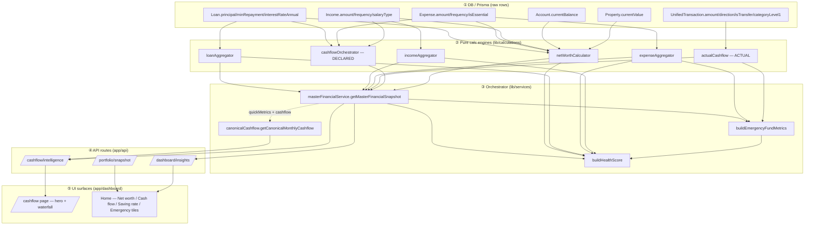

# Financial Logic Index — Relationships & Number Lineage

> The **third dimension** of the index: not just *what each engine does*, but
> *how they wire together* and *how any number on screen is born* — from a raw
> DB field, through the calc engines, the orchestrator, the API route, to the
> tile. Read this to understand how Monitrax actually computes, end to end.
>
> **Verified-only.** Every edge below was confirmed by reading the source this
> session (file:line cited where load-bearing). Edges for engines not yet
> documented in a spoke are **omitted**, not guessed — this map grows with the
> spokes. See [`00_INDEX.md`](00_INDEX.md) for the rules.
>
> **Scope today:** the core flow numbers (net worth, cashflow, emergency fund,
> health score) and their orchestration through `masterFinancialService`.

---

## 1. The five layers (how data moves)

**Reading the diagram:** raw rows (①) feed pure engines (②); the orchestrator
(③) composes the engines into one snapshot and derives emergency-fund + health;
`getCanonicalMonthlyCashflow` resolves the actual-vs-declared headline from the
snapshot; routes (④) serve it; tiles (⑤) render it. The **only** legitimate way
for a UI number to exist is to trace back through this graph to an ② engine.

---

## 2. Engine dependency graph (verified edges)

`masterFinancialService.getMasterFinancialSnapshot()` is the composition root.
Verified calls (file:line in `lib/services/masterFinancialService.ts`):

| Orchestrator step | Calls | Line | Feeds |
|---|---|---|---|
| Net worth | `calculateNetWorth(...)` | :1767 | `snapshot.netWorth`, `byEntity` |
| Declared cashflow | `calculateCashflow(input)` | :1819 | `snapshot.cashflow`, declared `quickMetrics` |
| Debt | `aggregateLoanRepayments(loanInputs,'monthly')` | :1831 | `snapshot.debt`, health-score debt inputs |
| Actual cashflow | `computeActualCashflow(...)` | :1857 | `quickMetrics.actual*`, emergency-fund denominator |
| Expense breakdown | `aggregateExpenses(...)` / `...ByCategory` | :874+ | `snapshot.expenses`, health, emergency fallback |
| Income breakdown | `aggregateIncome(...)` | :1005+ | `snapshot.income`, health |
| Emergency fund | `buildEmergencyFundMetrics(liquidCash, outflow)` | :1910 | `snapshot.emergencyFund` |
| Health score | `buildHealthScore(...)` | :1916 | `snapshot.healthScore` |
| Per-entity | `buildEntityBreakdown(...)` | :36 import | `snapshot.byEntity` |

**Derived-metric dependencies (the subtle ones):**

- **Emergency fund** `monthsCovered = liquidCash / monthlyOutflow`, where
  `monthlyOutflow = actualCashflow.avgMonthlyOutflow` **when** `hasActualData`,
  else `expenses.monthly.all.total` (`masterFinancialService.ts:1907`). So the
  emergency tile depends on **actualCashflow** (primary) + **expenseAggregator**
  (fallback). The displayed "/month" figure is this same `monthlyExpenses`
  (the #1201 fix — it must not show the declared total instead).
- **Health score** depends on income (net), expense, loan aggregators, the
  emergency-fund `monthsCovered`, and net worth (`buildHealthScore(...)` args,
  `:1916`). It is a **second-order** number — a change in any of those engines
  moves the health score.
- **Canonical cashflow** depends on `quickMetrics` (actual, from
  `computeActualCashflow`) + `cashflow` (declared, from `calculateCashflow`).
  It chooses actual-when-present (CLAUDE.md §19.1).

---

## 3. Number lineage — "how is this number generated?"

For each headline number: the exact chain from raw field → engine → accessor →
route → tile. (Verified this session.)

| User-facing number | Raw inputs | Engine(s) | Orchestrator field | Route | UI surface |
|---|---|---|---|---|---|
| **Net worth** | Property.currentValue, Account.currentBalance, Investment units×price, Super.balance (non-SMSF), Asset.currentValue, Loan.principal | `calculateNetWorth` | `snapshot.netWorth` | `/portfolio/snapshot` | Home "Net worth" |
| **Monthly cash flow (this month)** | UnifiedTransaction (actual) OR Income/Expense/Loan (declared fallback) | `computeActualCashflow` → `getCanonicalMonthlyCashflow` | `quickMetrics.actualNetCashflow` / canonical `.net` | `/cashflow/intelligence` | `/cashflow` hero ✅ converged |
| **Saving rate** | same as above | `getCanonicalMonthlyCashflow` | canonical `.savingsRate` | `/cashflow/intelligence` | `/cashflow` hero ✅ |
| **Money-flow waterfall** | UnifiedTransaction by category | `computeActualCashflow` (`actualOutflowByCategory`) | `quickMetrics.actualOutflowByCategory` | `/cashflow/intelligence` | `/cashflow` waterfall ✅ |
| **Emergency fund months** | liquidCash + (actual avg outflow ‖ declared expenses) | `computeActualCashflow` + `buildEmergencyFundMetrics` | `snapshot.emergencyFund.monthsCovered` + `.monthlyExpenses` | `/dashboard/insights` | Home Emergency tile ✅ (#1201 denom fix) |
| **Health score** | income/expense/loan aggregates + emergency + net worth | `buildHealthScore` | `snapshot.healthScore` | `/dashboard/insights` | Home Health tile |
| **Home Monthly Cash Flow / Annual Outgoings / Saving Rate** | Income/Expense/Loan **declared** (× frequency) | `calculateCashflow` (declared) | `snapshot.cashflow.*` | `/portfolio/snapshot` | Home tiles — ⚠️ **DECLARED, Phase 2b pending** (drill-down tie-out blocks a backend-only switch to actual) |

> The last row is the known open gap: the Home tiles are still declared because
> converging them needs a drill-down redesign (see `01_CORE_CALCULATIONS.md` §4
> Consumers + `AUDIT_CASHFLOW_SSOT.md` §6).

---

## 4. The two snapshot SSOTs (do not confuse — CLAUDE.md §12.2)

| Snapshot | Question it answers | Entry | Scope |
|---|---|---|---|
| `getMasterFinancialSnapshot()` | "What's my financial position right now?" | `lib/services/masterFinancialService.ts` | totals, breakdowns, ratios, health, emergency, quickMetrics |
| `/api/portfolio/snapshot` (`SnapshotV2`) | "What does my portfolio look like as a relational graph?" | `app/api/portfolio/snapshot/route.ts` → `lib/intelligence/insightsEngine.ts` | per-entity GRDCS `_links`/`_meta`, `linkageHealth`, `relationalInsights` |

They are **not** duplicates. Master does not expose GRDCS data; portfolio/snapshot
does not expose the master ratios. (This is why the Home cashflow tiles read
portfolio/snapshot's *own* declared block, not master — the Phase 2b gap.)

---

## 5. How to extend this map (per new spoke)

When a domain spoke is added, append here: (a) its engines into the §1 diagram,
(b) its verified call-edges into §2, (c) any new headline numbers into the §3
lineage table. Never add an edge you haven't confirmed in source.

---

*Created 2026-06-23. Part of `0·FIN-LOGIC-INDEX`. Scope: core flow numbers +
master orchestration; grows with each domain spoke.*
